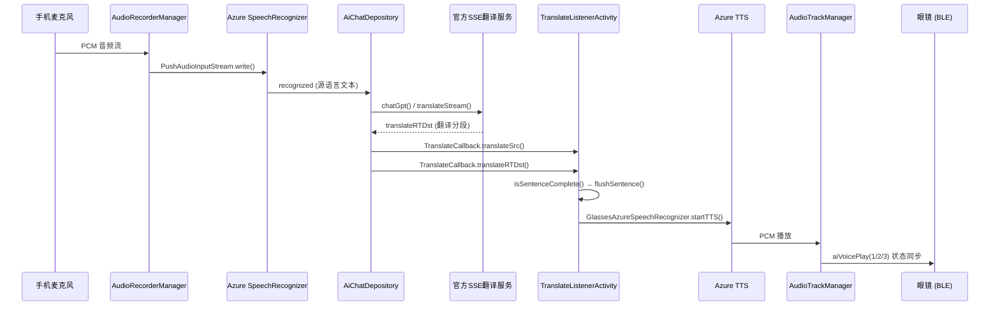

# Cyan Glasses APK 全面逆向分析报告

> 工具: JADX 1.5.3 反编译 `Cyan_Glasses_1.0.1.20_20251108.apk`
> 
> 重点: **同声传译 / 自动翻译** 功能实现分析

---

## 一、APP 整体架构

### 1.1 包结构

```
com.aitowe.aitoglasses/
├── ai/               # AI 引擎（Azure ASR/TTS、AudioTrack）
│   └── spark/        # GlassesAzureSpeechRecognizer, AudioTrackManager
├── all/              # 工具、配置、Bean
│   ├── bean/         # QLanguageType (140+ 语言), SelectLanguageModel
│   ├── pref/         # UserConfig（用户配置持久化）
│   └── utils/        # AudioRecorderManager, NetWorkUtils, PermissionUtil
├── api/              # 网络请求 Bean (AiChatBean)
├── ble/              # 蓝牙管理
├── bus/              # EventBus 事件 (BusEvent, EventType)
├── code/             # 编码工具
├── database/         # Room 数据库
│   └── entity/       # TranslateEntity（翻译历史持久化）
├── depository/       # 核心业务逻辑
│   ├── AiChatDepository  # AI 对话 + 翻译数据仓库
│   └── IntentClassifier  # TFLite 意图分类器
├── home/             # 首页 UI
│   ├── activity/     # AiTranslateActivity, TranslateListenerActivity, etc.
│   └── viewmodel/    # AiTranslateVM
├── manager/          # BaseSettingActivity 等基础管理
├── ota/              # OTA 升级
├── setting/          # 设置页
├── stabilization/    # 画面稳定（眼镜）
└── wifi/             # WiFi 直连
```

### 1.2 关键依赖

| 依赖                         | 用途                                   |
| ---------------------------- | -------------------------------------- |
| **Azure Speech SDK**         | ASR（语音识别）+ TTS（语音合成）+ 翻译 |
| **TensorFlow Lite** (+NNAPI) | 本地意图分类模型推理                   |
| **OkHttp + SSE**             | 与官方 LLM 后端流式通信                |
| **Opus (JNI)**               | 眼镜 BLE 传输的音频解码                |
| **Room**                     | TranslateEntity 翻译历史存储           |
| **EventBus**                 | 组件间事件通信                         |
| **Koin**                     | 依赖注入 (ViewModel)                   |

---

## 二、翻译功能架构（核心）

### 2.1 入口与模式

`AiTranslateActivity` 是翻译功能的入口页，提供两种模式：

| 模式           | Activity                    | 说明                           |
| -------------- | --------------------------- | ------------------------------ |
| **同声传译**   | `TranslateListenerActivity` | 连续监听 → 实时翻译 → TTS 播放 |
| **一对一翻译** | `TranslateOneToOneActivity` | 类似对话式翻译                 |

> ⚠️ 同声传译模式需要 BLE 眼镜已连接 (`BleOperateManager.isConnected()`)。

### 2.2 同声传译 数据流



### 2.3 关键类与方法

#### `TranslateListenerActivity` (1212行)

| 字段/方法                                  | 作用                            |
| ------------------------------------------ | ------------------------------- |
| `translateContent: String`                 | 当前识别的源语言文本            |
| `translateDst: StringBuilder`              | 累积的翻译结果                  |
| `cacheSB: StringBuilder`                   | TTS 分句缓冲区                  |
| `transLateQueue: BlockingDeque<String>`    | TTS 排队播放队列（容量100）     |
| `defaultLanguageTop/Bottom: QLanguageType` | 翻译源/目标语言                 |
| `playVoice: Boolean`                       | TTS 静音开关                    |
| `startTranslate()`                         | 启动/停止翻译                   |
| `isSentenceComplete(text)`                 | 句子边界检测（标点 or ≥15字符） |
| `flushSentence()`                          | 将缓冲区推入 TTS 队列           |
| `textToTTS(text)`                          | 调用 Azure TTS 合成+播放        |
| `highlightText(text)`                      | UI 高亮当前播放文本             |
| `saveTranslate()`                          | 保存翻译历史到 Room DB          |

#### `TranslateCallback` 接口 (在 `AiChatDepository` 中定义)

```kotlin
interface TranslateCallback {
    fun translateSrc(src: String, sid: String)           // 源语言识别结果
    fun translateSrcNoSplicing(src, dst, sid, complete)   // 不拼接的识别
    fun translateRTDst(rtDst: String, sid: String)        // 实时翻译分段
    fun translateDst(src: String, same: Boolean, sid: String) // 翻译完成
    fun translateFail(reason: Int)                        // 翻译失败
}
```

### 2.4 翻译启动流程 (`startTranslate()`)

```kotlin
// 1. 防重复 & 设置语言对
AiChatDepository.setUserTranslateFromAndTo(fromLang, toLang)
GlassesAzureSpeechRecognizer.setTranslateTo(toLang)
GlassesAzureSpeechRecognizer.setTranslateLn(fromLang)  // "cn" → "zh"

// 2. 设置 voiceType = 1（翻译模式，区别于 voiceType=GPT 对话模式）
GlassesAzureSpeechRecognizer.voiceType = 1

// 3. 设置 ASR 语言
val asrLang = AiChatDepository.switchAsrLanguage(fromLang).asrLanguage
GlassesAzureSpeechRecognizer.setAiLanguage(asrLang)

// 4. 启动 Azure 连续识别（协程）
launch { /* 启动 ASR continuous recognition */ }

// 5. 启动手机麦克风录音
audioRecorder.startRecording()
```

### 2.5 句子边界检测与 TTS 排队

```kotlin
// 完成条件：标点结尾 OR 长度 ≥15
fun isSentenceComplete(text: String): Boolean {
    val punctuation = text.endsWith("。") || text.endsWith(".") || 
                      text.endsWith("?") || text.endsWith("！") || 
                      text.endsWith(",") || text.endsWith("，")
    if (text.length < 6) return false  // minBlockSize = 6
    return punctuation || text.length >= 15
}

// 刷新缓冲区 → 推入队列 → 后台线程取出播放
fun flushSentence() {
    transLateQueue.putLast(cacheSB.toString())
    cacheSB.clear()
    ktxRunOnBgSingle {
        val dst = transLateQueue.take()  // 阻塞等待
        textToTTS(dst)                    // Azure TTS
    }
}
```

---

## 三、Azure Speech 配置

### 3.1 翻译模式切换

`GlassesAzureSpeechRecognizer` 通过 `voiceType` 区分：

| voiceType | 模式     | 行为                      |
| --------- | -------- | ------------------------- |
| `GPT`     | AI 对话  | ASR → LLM SSE → TTS       |
| `1`       | 同声传译 | ASR → 服务端翻译SSE → TTS |

### 3.2 关键方法

| 方法                       | 用途                   |
| -------------------------- | ---------------------- |
| `setTranslate(from, to)`   | 设置翻译语言对         |
| `setTranslateLn(lang)`     | 设置 ASR 识别语言      |
| `setTranslateTo(to)`       | 设置 TTS 目标语言      |
| `setAiLanguage(lang)`      | 设置 Azure ASR 语言    |
| `startTTS(text)`           | 合成并播放目标语言文本 |
| `initStartTTS()`           | 初始化 TTS 引擎        |
| `stopTTS()`                | 停止 TTS               |
| `setPlayStateCallback(cb)` | 设置播放状态回调       |

### 3.3 PlayStateCallback

```kotlin
interface PlayStateCallback {
    fun startAudio(sid: String, text: String)   // TTS 开始播放
    fun audioPlaying(sid: String, text: String)  // 正在播放（高亮当前文本）
    fun endAudio(sid: String, complete: Boolean) // 播放结束
}
```

---

## 四、本地意图分类器 (`IntentClassifier`)

### 4.1 概述

使用 **TensorFlow Lite** 在设备端进行语音指令意图分类，支持 11 种语言。

| 属性           | 值                           |
| -------------- | ---------------------------- |
| 推理引擎       | TFLite + NNAPI（降级为 CPU） |
| 线程数         | 4                            |
| 默认置信度阈值 | 0.99                         |
| 默认语言       | "cn"                         |

### 4.2 支持的语言与模型文件

| 语言  | 模型文件                                 | 序列长度 |
| ----- | ---------------------------------------- | -------- |
| zh/cn | `tflite_compatible_chinese_model.tflite` | 50       |
| en    | `english_intent_model_with_noise.tflite` | 60       |
| fr    | `fr_intent_model_with_noise.tflite`      | 60       |
| de    | `de_intent_model_with_noise.tflite`      | 60       |
| es    | `es_intent_model_with_noise.tflite`      | 60       |
| it    | `it_intent_model_with_noise.tflite`      | 60       |
| ja    | `ja_intent_model_with_noise.tflite`      | 50       |
| ko    | `ko_intent_model_with_noise.tflite`      | 50       |
| nl    | `nl_intent_model_with_noise.tflite`      | 60       |
| ru    | `ru_intent_model_with_noise.tflite`      | 60       |

每种语言配有对应的 `vocabulary.json` 和 `labels.json`。

### 4.3 推理流程

```
文本输入 → 预处理（亚洲/西方语言分词）→ 词表映射序列 → padding → TFLite推理 → 置信度过滤 → 智能过滤 → 意图结果
```

- **亚洲语言** (zh/ja/ko): 最大正向匹配分词
- **西方语言**: 空格分词 + 小写 + 特殊字符清理
- **智能过滤**: 每种语言有关键词硬规则（如中文"看看前面"→`identify_objects`，"翻译"/"历史"等知识类问题→`unknown`）

### 4.4 已知意图（中文示例）

| 意图               | 触发关键词                                    |
| ------------------ | --------------------------------------------- |
| `identify_objects` | 你能看到什么、看看前面、识别物体、分析图像... |
| `unknown`          | 美国、首都、什么是、谁、哪里、翻译、关机...   |

---

## 五、语言支持 (`QLanguageType`)

支持 **140+ 语言变体**，使用 Azure Speech SDK BCP-47 语言代码，如：

- `zh-CN` (简体中文), `zh-TW` (繁體中文)
- `en-US`, `en-GB`, `en-AU` 等 15 种英语变体
- `es-ES`, `es-MX` 等 22 种西班牙语变体
- `ar-SA`, `ar-EG` 等 16 种阿拉伯语变体

用户可在翻译页面动态切换源语言和目标语言。

---

## 六、翻译历史存储

| 实体              | 字段                                                         |
| ----------------- | ------------------------------------------------------------ |
| `TranslateEntity` | uid, createTime, srcContent, dstContent, type                |
| ViewModel         | `AiTranslateVM.saveTranslate()` / `getAllTranslateHistory()` |
| 存储              | Room 数据库                                                  |

---

## 七、SDK 相关协议（翻译上下文）

| SDK 方法                                    | 作用                                        |
| ------------------------------------------- | ------------------------------------------- |
| `GlassesTouchSupportRsp.translationSupport` | 眼镜硬件是否支持翻译功能 (byte[8]==1)       |
| `LargeDataHandler.aiVoicePlay(status, cb)`  | 翻译播放状态通知眼镜 (1=开始/2=心跳/3=结束) |

---

## 八、复现要点（为 CyanBridge 开发参考）

### 8.1 翻译功能复现路线

1. **Azure Speech SDK** 集成（ASR + TTS + Translation）
   - 使用 `com.microsoft.cognitiveservices.speech` SDK
   - 需要 Azure Subscription Key
   
2. **替代方案**（不用 Azure）
   - ASR: 继续使用阿里云 NUI
   - 翻译: 使用 Qwen 大模型（已集成 DashScope）
   - TTS: 继续使用阿里云 NLS TTS
   - 优势: 无需额外 Azure 费用，复用现有 API keys

3. **UI 层复现**
   - 双区域布局（上方源语言、下方翻译结果）
   - 语言选择弹窗 (`PopupSelectLanguageBinding`)
   - 翻译历史列表 (`TranslateHistoryActivity`)
   - 实时文本高亮显示

4. **核心逻辑复现**
   - 句子边界检测 (`isSentenceComplete`)
   - 翻译队列管理 (`LinkedBlockingDeque`)
   - 播放状态回调 + 眼镜心跳同步

### 8.2 意图分类集成建议

官方使用了 TFLite 本地模型做意图分类（模型文件在 APK assets 中），但对于 CyanBridge：
- **简化方案**: 使用 Qwen LLM 做意图理解（已有基础）
- **进阶方案**: 后续可训练自定义 TFLite 模型做离线意图分类
