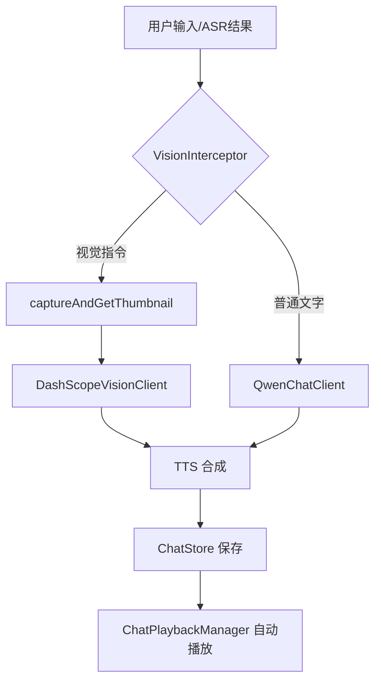
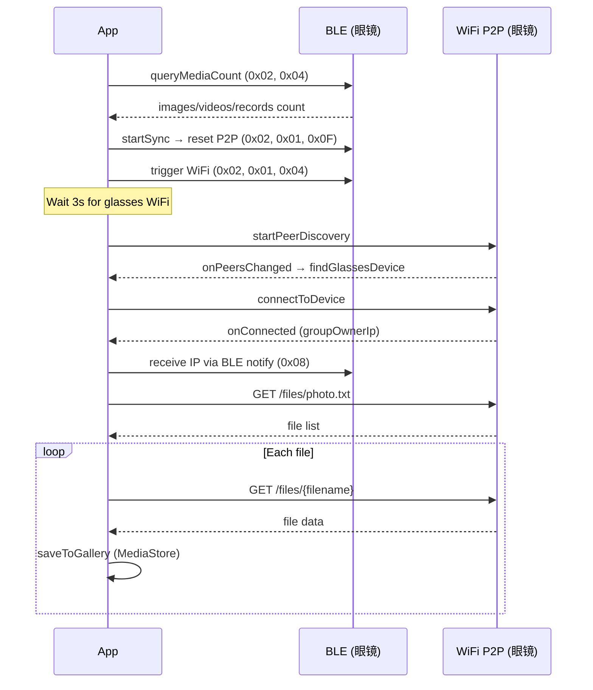
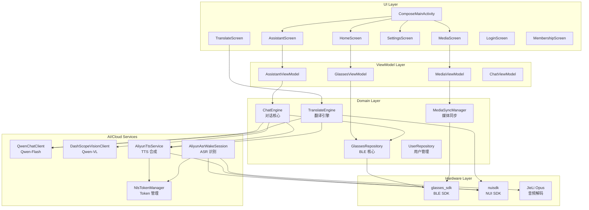

# CyanBridge 项目全面分析文档

> **项目名称**: CyanBridge  
> **包名**: `com.fersaiyan.cyanbridge`  
> **项目目录**: `android/CyanBridge`  
> **分析日期**: 2026-03-11  
> **版本**: v1.0.2 (versionCode 3)

---

## 1. 项目概述

CyanBridge 是一款 **盲人智能眼镜辅助 App**，通过 BLE (蓝牙低功耗) 连接 HeyCyan 系列智能眼镜硬件，提供以下核心功能：

- 🔗 **BLE 连接管理** — 扫描、配对、自动重连眼镜
- 📷 **媒体控制** — 拍照、录像、录音（通过 BLE 指令控制眼镜）
- 🤖 **AI 语音对话** — 眼镜语音唤醒 → ASR 识别 → 大模型回复 → TTS 朗读
- 👁️ **AI 视觉理解** — 眼镜拍照 → Qwen-VL 图像分析 → TTS 朗读结果
- 🌐 **同声传译** — 手机麦克风 → ASR → Qwen 翻译 → TTS 播放
- 📥 **媒体同步** — WiFi P2P 从眼镜下载照片/视频/录音到手机相册
- 🔐 **用户系统** — 手机号/邮箱/微信登录 + 会员等级体系
- ♿ **无障碍支持** — 盲人模式、高对比度、大字体、语音引导

---

## 2. 技术栈

| 分类 | 技术 |
|------|------|
| **语言** | Kotlin (主要) + Java (WiFi 工具类 & JieLi SDK 适配) |
| **最低 SDK** | API 24 (Android 7.0) |
| **目标 SDK** | API 35 |
| **JDK** | Java 17 |
| **UI 框架** | Jetpack Compose (主 UI) + 部分 XML Layout (Legacy) |
| **导航** | Jetpack Navigation Compose |
| **架构** | MVVM (ViewModel + StateFlow / Flow) |
| **异步** | Kotlin Coroutines + Flow |
| **事件总线** | EventBus (BLE 状态事件) |
| **网络** | OkHttp 4.12 |
| **JSON** | `org.json` (Android 内置) + FastJSON 1.1.46 (阿里云 SDK 依赖) |
| **图片加载** | Coil Compose 2.6 (含视频缩略图支持) |
| **权限** | XXPermissions 20.0 |
| **音频解码** | JieLi Opus Decoder (本地 JNI `jl_audio_decode`) |

---

## 3. 项目结构

```
android/CyanBridge/
├── app/
│   ├── build.gradle                    # 模块配置 (含 BuildConfig secrets)
│   ├── libs/                           # 本地 AAR / JAR
│   │   ├── glasses_sdk_20250723_v01.aar   # 眼镜 BLE SDK (oudmon)
│   │   ├── nuisdk-release.aar             # 阿里云 NUI SDK (ASR + TTS)
│   │   └── fastjson-1.1.46.android.jar    # FastJSON
│   └── src/main/
│       ├── AndroidManifest.xml
│       ├── jniLibs/                       # Native SO 文件
│       │   ├── arm64-v8a/
│       │   └── armeabi-v7a/
│       ├── java/com/fersaiyan/cyanbridge/
│       │   ├── MainActivity.kt            # Legacy XML Activity
│       │   ├── ai/                        # AI 模型客户端
│       │   ├── auth/                      # 用户认证 & 会员体系
│       │   ├── chat/                      # 对话引擎 & 存储
│       │   ├── glasses/                   # BLE 眼镜控制核心
│       │   ├── media/                     # 媒体同步 (WiFi P2P)
│       │   ├── net/                       # 网络控制器 (空文件)
│       │   ├── translate/                 # 同声传译引擎
│       │   ├── ui/                        # UI 层 (Compose + Legacy)
│       │   ├── vision/                    # 视觉指令检测
│       │   └── voice/                     # 语音相关 (ASR, TTS, Token)
│       │   └── com/jieli/                 # JieLi 音频解码 (Opus)
│       └── res/                           # 资源文件
├── tasker/                                # Tasker 自动化配置
│   └── Tasker_AI.xml
├── build.gradle.kts                       # 根配置
├── settings.gradle.kts                    # 模块声明
├── gradle.properties                      # Gradle 属性
└── local.properties                       # API Keys (不入 git)
```

---

## 4. 模块详解

### 4.1 `ai/` — AI 模型客户端

| 文件 | 说明 |
|------|------|
| [DashScopeVisionClient.kt](file:///Users/mysterio/0_projects/FROM_GITHUB/Alternative-HeyCyan-App-and-SDK/android/CyanBridge/app/src/main/java/com/fersaiyan/cyanbridge/ai/DashScopeVisionClient.kt) | **Qwen-VL 视觉理解客户端** — 接收 JPEG 图片 + 文字 prompt，通过 DashScope OpenAI-compatible API 发送 Base64 编码图片，返回中文描述。模型: `qwen3-vl-flash` |
| [QwenChatClient.kt](file:///Users/mysterio/0_projects/FROM_GITHUB/Alternative-HeyCyan-App-and-SDK/android/CyanBridge/app/src/main/java/com/fersaiyan/cyanbridge/ai/QwenChatClient.kt) | **Qwen-Flash 文本对话客户端** — 纯文字对话，使用 DashScope API，模型: `qwen-flash`，maxTokens=128，面向简短回答 |

> [!IMPORTANT]
> 两个 AI 客户端都使用 `BuildConfig.DASHSCOPE_API_KEY` 和 `BuildConfig.DASHSCOPE_BASE_URL`，需要在 `local.properties` 中配置。API 端点统一使用 OpenAI-compatible 格式: `/compatible-mode/v1/chat/completions`

---

### 4.2 `auth/` — 用户认证

| 文件 | 说明 |
|------|------|
| [UserState.kt](file:///Users/mysterio/0_projects/FROM_GITHUB/Alternative-HeyCyan-App-and-SDK/android/CyanBridge/app/src/main/java/com/fersaiyan/cyanbridge/auth/UserState.kt) | 用户数据模型 + 会员等级定义 (`FREE`, `NORMAL`, `ADVANCED`, `DIAMOND`) + 功能矩阵 |
| [UserRepository.kt](file:///Users/mysterio/0_projects/FROM_GITHUB/Alternative-HeyCyan-App-and-SDK/android/CyanBridge/app/src/main/java/com/fersaiyan/cyanbridge/auth/UserRepository.kt) | 用户管理器 (SharedPreferences 持久化)。**模拟验证码**: 统一为 `888888`，无真实后端 |

**会员等级与价格**:

| 等级 | 月价 | 年价 | 核心功能 |
|------|------|------|----------|
| 🆓 普通 | ¥0 | ¥0 | 基础连接、电量查看 |
| ⭐ 普通会员 | ¥9 | ¥88 | + 找物体、文字识别 |
| 🌟 高级会员 | ¥29 | ¥288 | + 人脸识别、拍照/录像/录音、媒体下载 |
| 💎 钻石会员 | ¥59 | ¥588 | + 表情识别、导航、语音对话、实时翻译 |

---

### 4.3 `chat/` — 对话引擎

| 文件 | 说明 |
|------|------|
| [ChatEngine.kt](file:///Users/mysterio/0_projects/FROM_GITHUB/Alternative-HeyCyan-App-and-SDK/android/CyanBridge/app/src/main/java/com/fersaiyan/cyanbridge/chat/ChatEngine.kt) | **核心对话引擎 (单例)**。统一入口 `submitUserText()`：接收文本 → VisionInterceptor 判断是否视觉指令 → 调用 QwenChat 或 DashScopeVision → TTS 合成 → 自动播放 |
| [ChatStore.kt](file:///Users/mysterio/0_projects/FROM_GITHUB/Alternative-HeyCyan-App-and-SDK/android/CyanBridge/app/src/main/java/com/fersaiyan/cyanbridge/chat/ChatStore.kt) | 对话历史持久化 (JSON 文件: `chat_history.json`)，内存 StateFlow + 磁盘 JSON 双存储 |
| [ChatRepository.kt](file:///Users/mysterio/0_projects/FROM_GITHUB/Alternative-HeyCyan-App-and-SDK/android/CyanBridge/app/src/main/java/com/fersaiyan/cyanbridge/chat/ChatRepository.kt) | 对话数据仓库，包装 ChatStore 的 CRUD 操作 |
| [ChatMessageEntity.kt](file:///Users/mysterio/0_projects/FROM_GITHUB/Alternative-HeyCyan-App-and-SDK/android/CyanBridge/app/src/main/java/com/fersaiyan/cyanbridge/chat/ChatMessageEntity.kt) | 消息数据类，字段: id, role, content, createdAt, status, source, audioPath, imagePath 等 |
| [ChatPlaybackManager.kt](file:///Users/mysterio/0_projects/FROM_GITHUB/Alternative-HeyCyan-App-and-SDK/android/CyanBridge/app/src/main/java/com/fersaiyan/cyanbridge/chat/ChatPlaybackManager.kt) | 全局自动播放管理器：监听 ChatStore 新消息，若有 audioPath 则自动播放 |
| [ChatTextParser.kt](file:///Users/mysterio/0_projects/FROM_GITHUB/Alternative-HeyCyan-App-and-SDK/android/CyanBridge/app/src/main/java/com/fersaiyan/cyanbridge/chat/ChatTextParser.kt) | 文本预处理：规范化用户输入 |
| [ChatConstants.kt](file:///Users/mysterio/0_projects/FROM_GITHUB/Alternative-HeyCyan-App-and-SDK/android/CyanBridge/app/src/main/java/com/fersaiyan/cyanbridge/chat/ChatConstants.kt) | 角色/状态/来源常量 (`ChatRoles.USER`, `ChatRoles.ASSISTANT`, `ChatSource.ASR`, `ChatSource.TEXT` 等) |

**对话引擎流程**:



---

### 4.4 `glasses/` — BLE 眼镜核心

| 文件 | 说明 |
|------|------|
| [GlassesRepository.kt](file:///Users/mysterio/0_projects/FROM_GITHUB/Alternative-HeyCyan-App-and-SDK/android/CyanBridge/app/src/main/java/com/fersaiyan/cyanbridge/glasses/GlassesRepository.kt) | **963行，最大核心文件**。单例，封装所有 BLE SDK 交互为 Flow-based API。功能包括：BLE 扫描/连接/断开、电池查询、语音唤醒检测（cmdType=0x73 sub=0x03）、拍照/录像/录音控制、**缩略图获取（复杂分页协议）**、JPEG 提取与 zlib 解压 |
| [GlassesViewModel.kt](file:///Users/mysterio/0_projects/FROM_GITHUB/Alternative-HeyCyan-App-and-SDK/android/CyanBridge/app/src/main/java/com/fersaiyan/cyanbridge/glasses/GlassesViewModel.kt) | Compose ViewModel，桥接 GlassesRepository 到 UI |

> [!TIP]
> `GlassesRepository` 中的 `captureAndGetThumbnail()` 是 AI 视觉管线的关键函数，支持重试 (maxRetries=2)、分页重组、JPEG 检测、zlib 解压、质量校验。

**BLE 控制指令表**:

| 指令 (hex) | 功能 |
|------------|------|
| `0x02, 0x01, 0x01` | 拍照 |
| `0x02, 0x01, 0x02` | 开始录像 |
| `0x02, 0x01, 0x03` | 停止录像 |
| `0x02, 0x01, 0x04` | 启动眼镜 WiFi (P2P) |
| `0x02, 0x01, 0x06, size, size, 0x02` | 拍照 + 获取缩略图 |
| `0x02, 0x01, 0x08` | 开始录音 |
| `0x02, 0x01, 0x0B` | 停止 AI 会话 |
| `0x02, 0x01, 0x0C` | 停止录音 |
| `0x02, 0x01, 0x0F` | 重置 P2P 状态 |
| `0x02, 0x04` | 查询媒体数量 |

**设备通知 (DeviceNotify) 解析**:

| cmdType | loadData[6] (sub) | 含义 |
|---------|-------------------|------|
| `0x73` | `0x03` (val=1) | 语音唤醒触发 |
| `0x73` | `0x01` | 拍照完成信号 |
| `0x73` | `0x02` | AI 拍照完成信号 |

---

### 4.5 `media/` — 媒体同步管理

| 文件 | 说明 |
|------|------|
| [MediaSyncManager.kt](file:///Users/mysterio/0_projects/FROM_GITHUB/Alternative-HeyCyan-App-and-SDK/android/CyanBridge/app/src/main/java/com/fersaiyan/cyanbridge/media/MediaSyncManager.kt) | **1184行**。WiFi P2P 媒体下载全流程管理器 |

**媒体同步流程**:



**关键设计**:
- 支持 `photo.txt` (官方格式) 和 `media.config` (自定义格式) 两种文件列表
- 文件类型识别: `.jpg/.jpeg` → PHOTO, `.mp4/.avi` → VIDEO, `.opus` → AUDIO, 无扩展名 → VIDEO
- 每个文件最多重试 1 次，连续错误 > 3 则中止
- P2P 网络绑定 (`bindProcessToNetwork`) 确保 HTTP 走 P2P 而非 Wi-Fi
- 候选 IP 策略: BLE 上报 IP > BleIpBridge IP > GroupOwner IP > 固定 fallback IP

---

### 4.6 `translate/` — 同声传译

| 文件 | 说明 |
|------|------|
| [TranslateEngine.kt](file:///Users/mysterio/0_projects/FROM_GITHUB/Alternative-HeyCyan-App-and-SDK/android/CyanBridge/app/src/main/java/com/fersaiyan/cyanbridge/translate/TranslateEngine.kt) | 同声传译引擎：手机麦克风 → 阿里云 ASR (NUI SDK) → Qwen 翻译 → 阿里云 TTS → 播放 |
| [LanguagePair.kt](file:///Users/mysterio/0_projects/FROM_GITHUB/Alternative-HeyCyan-App-and-SDK/android/CyanBridge/app/src/main/java/com/fersaiyan/cyanbridge/translate/LanguagePair.kt) | 语言对数据类 (中→英, 英→中 等) |

**状态机**: `IDLE → LISTENING → TRANSLATING → PLAYING → LISTENING`

**特性**:
- 句子边界检测: 标点符号或 >= 15 字符时切断翻译
- 翻译队列: `LinkedBlockingDeque`，异步消费
- ASR 完成后自动重启，实现连续翻译

---

### 4.7 `vision/` — 视觉指令

| 文件 | 说明 |
|------|------|
| [VisionInterceptor.kt](file:///Users/mysterio/0_projects/FROM_GITHUB/Alternative-HeyCyan-App-and-SDK/android/CyanBridge/app/src/main/java/com/fersaiyan/cyanbridge/vision/VisionInterceptor.kt) | 视觉指令拦截器：关键词匹配 → 5 种视觉模式 → 生成 Qwen-VL prompt |

**视觉模式**:

| 模式 | 触发关键词示例 | Prompt 主题 |
|------|---------------|-------------|
| `FIND_OBJECT` | "找到", "在哪", "帮我找" | 描述物体位置和距离 |
| `READ_TEXT` | "读文字", "识字", "念一下" | 识别并朗读图中文字 |
| `FACE` | "这个人", "是谁", "人脸" | 描述人物外观 (保护隐私) |
| `EMOTION` | "表情", "心情", "开心" | 描述面部表情和情绪 |
| `NAVIGATION` | "地铁站", "出口", "怎么走" | 描述方向和距离 |

---

### 4.8 `voice/` — 语音服务

| 文件 | 说明 |
|------|------|
| [AliyunAsrWakeSession.kt](file:///Users/mysterio/0_projects/FROM_GITHUB/Alternative-HeyCyan-App-and-SDK/android/CyanBridge/app/src/main/java/com/fersaiyan/cyanbridge/voice/AliyunAsrWakeSession.kt) | **语音唤醒 ASR 会话**：BLE 接收 Opus 音频 → JieLi 解码 PCM → 阿里云 NUI ASR → 文字结果。会话超时 30s |
| [AliyunTtsService.kt](file:///Users/mysterio/0_projects/FROM_GITHUB/Alternative-HeyCyan-App-and-SDK/android/CyanBridge/app/src/main/java/com/fersaiyan/cyanbridge/voice/AliyunTtsService.kt) | **阿里云 TTS 封装**：文本 → WAV 文件。音色: `zhiyue`，采样率: 16kHz，最大 300 字符，超时 30s |
| [NlsTokenManager.kt](file:///Users/mysterio/0_projects/FROM_GITHUB/Alternative-HeyCyan-App-and-SDK/android/CyanBridge/app/src/main/java/com/fersaiyan/cyanbridge/voice/NlsTokenManager.kt) | **Token 自动管理器 (单例)**：AccessKey ID + Secret → HMAC-SHA1 签名 → CreateToken API → 缓存 + 过期前 5 分钟自动刷新。不配置 AK 时回退到静态 Token |
| [OpenAiClient.kt](file:///Users/mysterio/0_projects/FROM_GITHUB/Alternative-HeyCyan-App-and-SDK/android/CyanBridge/app/src/main/java/com/fersaiyan/cyanbridge/voice/OpenAiClient.kt) | (Legacy) OpenAI 客户端 |
| [GlassesVoiceChatMvp.kt](file:///Users/mysterio/0_projects/FROM_GITHUB/Alternative-HeyCyan-App-and-SDK/android/CyanBridge/app/src/main/java/com/fersaiyan/cyanbridge/voice/GlassesVoiceChatMvp.kt) | (Legacy) MVP 语音对话 |
| [WavWriter.kt](file:///Users/mysterio/0_projects/FROM_GITHUB/Alternative-HeyCyan-App-and-SDK/android/CyanBridge/app/src/main/java/com/fersaiyan/cyanbridge/voice/WavWriter.kt) | WAV 文件写入工具 |

**ASR 音频管线**:


---

### 4.9 `ui/` — UI 层

#### 4.9.1 Compose 页面 (`ui/screens/`)

| 文件 | 说明 |
|------|------|
| [HomeScreen.kt](file:///Users/mysterio/0_projects/FROM_GITHUB/Alternative-HeyCyan-App-and-SDK/android/CyanBridge/app/src/main/java/com/fersaiyan/cyanbridge/ui/screens/HomeScreen.kt) | **首页** (895行)。眼镜连接卡片 + 快捷操作 (拍照/录像/录音/教程) + BLE 扫描弹窗。支持盲人模式简化布局 |
| [AssistantScreen.kt](file:///Users/mysterio/0_projects/FROM_GITHUB/Alternative-HeyCyan-App-and-SDK/android/CyanBridge/app/src/main/java/com/fersaiyan/cyanbridge/ui/screens/AssistantScreen.kt) | 语音助手页面 |
| [AssistantViewModel.kt](file:///Users/mysterio/0_projects/FROM_GITHUB/Alternative-HeyCyan-App-and-SDK/android/CyanBridge/app/src/main/java/com/fersaiyan/cyanbridge/ui/screens/AssistantViewModel.kt) | 助手 ViewModel |
| [MediaScreen.kt](file:///Users/mysterio/0_projects/FROM_GITHUB/Alternative-HeyCyan-App-and-SDK/android/CyanBridge/app/src/main/java/com/fersaiyan/cyanbridge/ui/screens/MediaScreen.kt) | 媒体库页面 (照片/视频/录音浏览 + 同步) |
| [MediaViewModel.kt](file:///Users/mysterio/0_projects/FROM_GITHUB/Alternative-HeyCyan-App-and-SDK/android/CyanBridge/app/src/main/java/com/fersaiyan/cyanbridge/ui/screens/MediaViewModel.kt) | 媒体 ViewModel |
| [SettingsScreen.kt](file:///Users/mysterio/0_projects/FROM_GITHUB/Alternative-HeyCyan-App-and-SDK/android/CyanBridge/app/src/main/java/com/fersaiyan/cyanbridge/ui/screens/SettingsScreen.kt) | 设置页面 |
| [TranslateScreen.kt](file:///Users/mysterio/0_projects/FROM_GITHUB/Alternative-HeyCyan-App-and-SDK/android/CyanBridge/app/src/main/java/com/fersaiyan/cyanbridge/ui/screens/TranslateScreen.kt) | 翻译页面 |
| [LoginScreen.kt](file:///Users/mysterio/0_projects/FROM_GITHUB/Alternative-HeyCyan-App-and-SDK/android/CyanBridge/app/src/main/java/com/fersaiyan/cyanbridge/ui/screens/LoginScreen.kt) | 登录页面 (手机号/邮箱/微信) |
| [MembershipScreen.kt](file:///Users/mysterio/0_projects/FROM_GITHUB/Alternative-HeyCyan-App-and-SDK/android/CyanBridge/app/src/main/java/com/fersaiyan/cyanbridge/ui/screens/MembershipScreen.kt) | 会员购买页面 |
| [TutorialCard.kt](file:///Users/mysterio/0_projects/FROM_GITHUB/Alternative-HeyCyan-App-and-SDK/android/CyanBridge/app/src/main/java/com/fersaiyan/cyanbridge/ui/screens/TutorialCard.kt) | 使用教程卡片组件 |

#### 4.9.2 导航

| 文件 | 说明 |
|------|------|
| [AppNavigation.kt](file:///Users/mysterio/0_projects/FROM_GITHUB/Alternative-HeyCyan-App-and-SDK/android/CyanBridge/app/src/main/java/com/fersaiyan/cyanbridge/ui/navigation/AppNavigation.kt) | 底部导航栏 (首页/助手/媒体/设置) + 子页面路由 (翻译/登录/会员)。支持语音播报页面切换 |

**路由结构**:

```
home           → HomeScreen (底部导航)
assistant      → AssistantScreen (底部导航)
media          → MediaScreen (底部导航)
settings       → SettingsScreen (底部导航)
translate      → TranslateScreen (子页面, 无底部栏)
login          → LoginScreen (子页面, 无底部栏)
membership     → MembershipScreen (子页面, 无底部栏)
```

#### 4.9.3 主题与无障碍

| 文件 | 说明 |
|------|------|
| [Theme.kt](file:///Users/mysterio/0_projects/FROM_GITHUB/Alternative-HeyCyan-App-and-SDK/android/CyanBridge/app/src/main/java/com/fersaiyan/cyanbridge/ui/theme/Theme.kt) | 3 套配色方案: Dark / Light / HighContrast (纯黑背景+黄色高亮)。支持大字体排版 |
| [AccessibilityPrefs.kt](file:///Users/mysterio/0_projects/FROM_GITHUB/Alternative-HeyCyan-App-and-SDK/android/CyanBridge/app/src/main/java/com/fersaiyan/cyanbridge/ui/accessibility/AccessibilityPrefs.kt) | 无障碍偏好: 盲人模式、高对比度、大字体、语音引导 |
| [AccessibleComponents.kt](file:///Users/mysterio/0_projects/FROM_GITHUB/Alternative-HeyCyan-App-and-SDK/android/CyanBridge/app/src/main/java/com/fersaiyan/cyanbridge/ui/accessibility/AccessibleComponents.kt) | 大触摸按钮等无障碍组件 |

#### 4.9.4 Legacy & 工具类

| 文件 | 说明 |
|------|------|
| [ComposeMainActivity.kt](file:///Users/mysterio/0_projects/FROM_GITHUB/Alternative-HeyCyan-App-and-SDK/android/CyanBridge/app/src/main/java/com/fersaiyan/cyanbridge/ui/ComposeMainActivity.kt) | **LAUNCHER Activity**。Compose 入口，替代旧版 XML Activity |
| [MyApplication.kt](file:///Users/mysterio/0_projects/FROM_GITHUB/Alternative-HeyCyan-App-and-SDK/android/CyanBridge/app/src/main/java/com/fersaiyan/cyanbridge/ui/MyApplication.kt) | Application 初始化：BLE + ChatEngine + ChatPlaybackManager + GlassesRepository |
| [BleIpBridge.kt](file:///Users/mysterio/0_projects/FROM_GITHUB/Alternative-HeyCyan-App-and-SDK/android/CyanBridge/app/src/main/java/com/fersaiyan/cyanbridge/ui/BleIpBridge.kt) | BLE 特征值监听器: 提取 IP 地址 + 缩略图分页信息 (bcfd 头解析) |
| [P2PController.kt](file:///Users/mysterio/0_projects/FROM_GITHUB/Alternative-HeyCyan-App-and-SDK/android/CyanBridge/app/src/main/java/com/fersaiyan/cyanbridge/ui/P2PController.kt) | WiFi P2P 控制器 |
| `ui/wifi/` | WiFi Direct 工具集 (36 个文件): 连接/扫描/断开/WPS/P2P 管理 |
| `ui/chat/` | Legacy 聊天 UI (XML Activity + RecyclerView Adapter) |

---

### 4.10 `com.jieli.jl_audio_decode` — JieLi 音频解码

Opus 音频解码库，用于将眼镜通过 BLE 发送的 Opus 编码语音数据解码为 PCM 供 ASR 使用。

| 文件 | 说明 |
|------|------|
| `OpusManager.java` | Opus 解码管理器, 提供 `startDecodeStream()` / `writeAudioStream()` / `stopDecodeStream()` |
| `OpusOption.java` | Opus 配置 (采样率 16kHz, 帧大小 40, 单声道) |
| `OnDecodeStreamCallback.java` | 解码回调: onStart / onDecodeStream(pcm) / onComplete / onError |

---

## 5. 核心三方 SDK

### 5.1 glasses_sdk (oudmon BLE SDK)

**路径**: `app/libs/glasses_sdk_20250723_v01.aar`

核心类：
- `BleOperateManager` — BLE 连接管理 (连接/断开)
- `BleBaseControl` — BLE 基础控制
- `BleScannerHelper` — BLE 设备扫描
- `LargeDataHandler` — BLE 大包数据传输 (拍照/录像/电池/缩略图/AI 对话等)
- `DeviceManager` — 已连接设备信息

### 5.2 nuisdk (阿里云 NUI SDK)

**路径**: `app/libs/nuisdk-release.aar` (62MB，含 JNI native lib)

功能：
- **ASR (语音识别)** — `NativeNui` + `INativeNuiCallback`
- **TTS (语音合成)** — `NativeNui(MODE_TTS)` + `INativeTtsCallback`
- 服务地址: `wss://nls-gateway-cn-shanghai.aliyuncs.com/ws/v1`

---

## 6. 配置与密钥

所有 API 密钥通过 `local.properties` 注入 `BuildConfig`（不入 Git）：

```properties
# 阿里云 DashScope (AI 对话 + 视觉)
DASHSCOPE_API_KEY=sk-xxxx
DASHSCOPE_BASE_URL=https://dashscope.aliyuncs.com

# 阿里云 NLS (ASR + TTS)
ALIYUN_ASR_APPKEY=xxxx
ALIYUN_AK_ID=LTAIxxxx          # Token 自动刷新
ALIYUN_AK_SECRET=xxxx           # Token 自动刷新
ALIYUN_ASR_TOKEN=xxxx           # 静态 Token (可选回退)
ALIYUN_TTS_APPKEY=xxxx          # 可选，默认与 ASR 相同
ALIYUN_TTS_TOKEN=xxxx           # 可选，默认与 ASR 相同

# OpenAI (Legacy, 未使用)
OPENAI_API_KEY=xxxx
OPENAI_BASE_URL=https://api.openai.com
OPENAI_CHAT_MODEL=gpt-4o-mini
OPENAI_TRANSCRIBE_MODEL=whisper-1
```

---

## 7. 权限清单

| 权限 | 用途 |
|------|------|
| `BLUETOOTH_CONNECT/SCAN/ADVERTISE` | BLE 连接/扫描 |
| `INTERNET` | AI API 调用 |
| `RECORD_AUDIO` | 同声传译 |
| `ACCESS_WIFI_STATE/CHANGE_WIFI_STATE` | WiFi P2P |
| `NEARBY_WIFI_DEVICES` | WiFi Direct (Android 13+) |
| `WRITE/READ_EXTERNAL_STORAGE` | 媒体保存 |
| `FOREGROUND_SERVICE` | 后台保活 |
| `WAKE_LOCK` | 屏幕常亮 |
| `REQUEST_IGNORE_BATTERY_OPTIMIZATIONS` | 电池优化白名单 |

---

## 8. 业务架构总览



---

## 9. 关键数据流

### 9.1 语音唤醒 → AI 回复完整流程

```
1. 眼镜检测到语音 → BLE DeviceNotify (cmdType=0x73, sub=0x03, val=1)
2. GlassesRepository.onVoiceWakeTriggered() → 去抖 (800ms)
3. AliyunAsrWakeSession.start() →
   3a. BLE 大包 Opus 接收 (cmdType=0x59)
   3b. OpusManager 解码 → PCM 16kHz
   3c. AudioByteQueue → NUI SDK → ASR
4. ASR 结果 → ChatEngine.submitUserText(text, "asr")
5. VisionInterceptor.isVisionCommand(text) → null (普通对话)
6. QwenChatClient.chat(text) → AI 回复
7. AliyunTtsService.synthesizeToFile(reply) → WAV 文件
8. ChatStore.insert(message with audioPath)
9. ChatPlaybackManager 自动播放 WAV
```

### 9.2 AI 视觉识别流程

```
1. 用户说 "帮我找水杯" → ASR → ChatEngine.submitUserText()
2. VisionInterceptor → VisionMode.FIND_OBJECT
3. TTS 提示 "正在拍照识别，请稍候"
4. GlassesRepository.captureAndGetThumbnail():
   4a. Drain 旧数据
   4b. 发送拍照指令 (0x02, 0x01, 0x06)
   4c. 等待 photo signal (DeviceNotify sub=0x01/0x02)
   4d. 接收缩略图分页 (bcfd 头协议)
   4e. 重组分页 → JPEG 提取 (zlib/raw) → 质量校验
5. DashScopeVisionClient.describeImage(jpegFile, prompt) → 图片分析
6. AliyunTtsService.synthesizeToFile(reply) → WAV
7. 保存结果 (含 imagePath) 到 ChatStore
```

---

## 10. 开发注意事项

> [!WARNING]
> - **不要直接 `pip install`** 或在 `base` conda 环境安装依赖 (见 AGENTS.md)
> - **API 密钥** 必须放在 `local.properties`，不要提交到 Git
> - `nuisdk-release.aar` 约 62MB，含 ARM native 库，编译和 APK 体积较大

> [!CAUTION]
> - `NlsTokenManager.getTokenBlocking()` 包含网络请求，**不能在主线程调用** (会抛 `NetworkOnMainThreadException`)
> - 眼镜缩略图协议有多种格式 (带 bcfd 头 / 无头 / zlib 压缩)，需要兼容处理
> - WiFi P2P 连接不稳定，需要重试和 fallback IP 策略

> [!NOTE]
> - Legacy XML Activity (`MainActivity`) 保留,但 LAUNCHER 已指向 `ComposeMainActivity`
> - `net/WifiP2pController.kt` 是空文件, 实际 P2P 逻辑在 `MediaSyncManager` 和 `ui/wifi/p2p/` 中
> - 用户系统为**模拟实现**, 验证码统一 `888888`, 无真实后端

---

## 11. 文件统计

| 类别 | 数量 |
|------|------|
| **Kotlin 源文件** | ~72 |
| **Java 源文件** | ~30 (WiFi 工具 + JieLi SDK) |
| **总源代码文件** | ~102 |
| **最大文件** | MediaSyncManager.kt (1184行), GlassesRepository.kt (963行), HomeScreen.kt (895行) |
| **AAR/JAR 依赖** | 3 (glasses_sdk, nuisdk, fastjson) |
| **JNI 架构** | arm64-v8a, armeabi-v7a |
| **资源文件** | 41 (layouts, drawables, mipmaps, xml) |
