# Cyan Glasses Official APK: 语音唤醒 / ASR / LLM / TTS 逻辑与指令整理

> 目的：把官方 APK（解包 + dexdump）里与「语音唤醒、语音识别、语音生成、大模型对话」相关的**关键指令**与**代码逻辑**整理成一份可复用的参考笔记，后续再讨论如何在 CyanBridge 里按同样链路实现（本文件不涉及直接改你项目代码）。
>
> 注意：
> - 官方链路依赖 `token` + 签名 + 官方 SSE 后端；实现自有 LLM 时可以复用 BLE 音频/ASR/TTS 部分，替换中间的“LLM 请求层”。
> - 不要把任何真实 `token`/订阅 key/账号信息写入仓库或提交。

## 0. 证据来源（你当前机器上的路径）

- 官方 APK（样本）：`/Users/mysterio/0_projects/FROM_GITHUB/Alternative-HeyCyan-App-and-SDK/Cyan_Glasses_1.0.1.20_20251108.apk`
- APK 解包目录：`/tmp/cyan_glasses_apk/`
- 关键 dexdump/摘录：
  - `GlassesAzureSpeechRecognizer`（语音整条链路核心类）：`/tmp/glasses_azure_speech_recognizer.txt`
  - `classes28.dex` 全量：`/tmp/cyan_classes28_dexdump.txt`（包含 `GlassesAzureSpeechRecognizer$5`，即 AI 语音流解析器）
  - `classes31.dex` 全量：`/tmp/cyan_classes31_dexdump.txt`（包含 `SSEHandler`，SSE + 签名）
  - `classes17.dex` 全量：`/tmp/cyan_classes17_dexdump.txt`（包含 `AiChatDepository` 及 chatGpt 流式处理）
  - `classes22.dex`（包含 `AiChatBean` 定义）：`/tmp/cyan_classes22_dexdump.txt`
- 眼镜 BLE SDK（AAR，CyanBridge 也在用）：`/Users/mysterio/0_projects/FROM_GITHUB/Alternative-HeyCyan-App-and-SDK/android/CyanBridge/app/libs/glasses_sdk_20250723_v01.aar`
- AAR 解包/Javap：`/tmp/cyan_sdk_jar/`（`LargeDataHandler` 等）

## 1. 官方“语音 + 大模型 + 语音播报”端到端链路（高层）

官方并不是“手机麦克风直接录音 -> SpeechRecognizer”，而是：

1) 眼镜侧进入 AI 语音/对话模式后，通过 BLE 大包持续推送 **Opus 音频帧流**  
2) 手机端收到 BLE Opus 流（cmdType=0x59），用 `OpusManager` 解码成 16kHz/mono PCM  
3) PCM 写入 Azure Speech SDK 的 `PushAudioInputStream` 做 ASR  
4) Azure 识别出“最终文本”（recognized 事件，相当于“官方能判断你说完了”）  
5) 把文本打包为 messages（`AiChatBean(role, content, type)` 列表）发到官方 SSE：`/glasses/ai/chat/stream/...`  
6) SSE 流式返回内容，边收边落库/回调；完成后触发 Azure TTS 合成 PCM  
7) 手机端 `AudioTrackManager` 播放 PCM，同时通过 BLE `aiVoicePlay()` 给眼镜上报播放状态/心跳

```mermaid
flowchart LR
  A["Glasses mic\n(眼镜麦克风)"] --> B["BLE BigData\ncmdType=0x59 (89)\nOpus frames"]
  B --> C["Phone: Opus decode\ncom.jieli.jl_audio_decode.opus.OpusManager\n16kHz mono PCM"]
  C --> D["Azure ASR\nPushAudioInputStream -> SpeechRecognizer"]
  D -->|recognized 最终文本| E["AiChatDepository.chatGpt()\nSSEHandler.startStream()"]
  E -->|SSE stream content| F["Azure TTS\nSpeechSynthesizer\nRaw16Khz16BitMonoPcm"]
  F --> G["AudioTrackManager\n播放 PCM"]
  G --> H["BLE aiVoicePlay(1/2/3)\n播放开始/心跳/结束"]
```



## 2. 相关 SDK / 关键库清单（官方 APK 视角）

### 2.1 BLE/眼镜 SDK（Vendor AAR）

- 包名/入口：`com.oudmon.ble.base.communication.LargeDataHandler`（在 vendor AAR `classes.jar` 内）
- 关键点：
  - `initPackageNotify(ILargeDataResponse<AiChatResponse>)`：把 cmdType=89(0x59) 映射到回调（AI 语音流）
  - `glassesControl(byte[] payload, ILargeDataResponse cb)`：发控制指令（开始/停止 AI 语音推流等）
  - `aiVoicePlay(int status, cb)`：上报播放状态/心跳
  - `aiVoiceWake(boolean enable, boolean flag, listener)`：看起来是“AI 语音唤醒/开关”类能力（语义需结合 UI 再确认）

### 2.2 Opus 解码（Jieli）

官方 Java 层用：`com.jieli.jl_audio_decode.opus.OpusManager`

官方 APK 同时打包了所需 JNI so（**注意你的 MVP 崩溃日志就是缺这个依赖**）：

- `libjl_opus.so`
- `libst_opus.so`
- `libjl_speex.so`
- `libcbuf.so`

路径示例：`/tmp/cyan_glasses_apk/lib/arm64-v8a/libcbuf.so` 等

### 2.3 ASR/TTS（Microsoft Azure Speech SDK）

官方 APK `lib/*` 里包含：

- `libMicrosoft.CognitiveServices.Speech.core.so`
- `libMicrosoft.CognitiveServices.Speech.java.bindings.so`
- 以及扩展库（codec、lu、kws 等），其中 KWS 相关：
  - `libMicrosoft.CognitiveServices.Speech.extension.kws.so`
  - `libMicrosoft.CognitiveServices.Speech.extension.kws.ort.so`

> 本轮整理只确认“库存在 + ASR/TTS 代码链路明确”；**尚未定位到官方是否真的启用 Azure KWS（本地唤醒词）**，见第 8 节待补全点。

### 2.4 LLM SSE（OkHttp SSE + Gson）

- SSE client：`okhttp3-sse`（`EventSource`, `EventSources.createFactory()`）
- JSON：`Gson`（`GsonInstance.getGson().toJson(messages)`）
- 官方 SSE base：
  - `https://www.qlifesnap.com/glasses/ai/chat/stream`

## 3. BLE 指令/协议（与语音/对话相关）

下面列出官方 APK 实际调用到的指令（payload 为 `glassesControl()` 的 subData）以及 vendor SDK 的相关命令号。

### 3.1 AI 语音流 notify：cmdType = 89 (0x59)

1) 先注册回调（cmdType=89）：

- `LargeDataHandler.initPackageNotify(aiChatListener)`

2) AI 语音数据回调在官方 APK：

- `com.aitowe.aitoglasses.ai.spark.GlassesAzureSpeechRecognizer$5.parseData(cmdType, AiChatResponse)`
  - `if (cmdType == 89)`：
    - `subData = response.getSubData()`
    - `tempData = Arrays.copyOfRange(subData, 6, subData.length)`
    - `this$0.receiveOpusData(tempData)`

证据：`/tmp/cyan_classes28_dexdump.txt` 中 `GlassesAzureSpeechRecognizer$5.parseData`（`copyOfRange(..., 6, len)`）。

含义：**subData 前 6 字节是头部；后面才是 Opus payload**。

### 3.2 开始 AI 语音推流（眼镜 -> 手机）：`[0x02, 0x01, 0x07]`

官方触发点：

- `com.aitowe.aitoglasses.ai.spark.GlassesAzureSpeechRecognizer.startNextChat()`
  - `initData()`
  - `LargeDataHandler.initPackageNotify(aiChatListener)`
  - `LargeDataHandler.glassesControl([0x02,0x01,0x07], callback)`
  - `timeoutTask(10)`（10 秒保护超时）

证据：`/tmp/glasses_azure_speech_recognizer.txt` 中 `startNextChat` 的 fill-array-data。

### 3.3 停止 AI 语音推流/退出 AI：`[0x02, 0x01, 0x0B]`

官方使用场景：

- ASR 拿到最终文本（recognized）后立即 stop 推流（避免继续塞音频导致识别/会话紊乱）
- `exitAi()` 主动退出
- `timeoutTask(10s)` 触发超时也会发这个停止指令

证据：

- `GlassesAzureSpeechRecognizer.exitAi()` 的 array-data `0201 0b00`（见 `./tmp/glasses_azure_speech_recognizer.txt`）。

### 3.4 播放状态/心跳：`LargeDataHandler.aiVoicePlay(status, cb)`

vendor SDK（AAR）中 `aiVoicePlay`：

- action code：`72`
- subData 格式：`[0x02, status]`

官方 status 用法（在 `GlassesAzureSpeechRecognizer`）：

- `status=1`：开始播放（`startAudio()` 里调用）
- `status=2`：播放心跳（每 2 秒一次，`playHeart` runnable）
- `status=3`：播放结束（`endAudio(complete=true)`）

证据：

- `LargeDataHandler.aiVoicePlay` 的字节格式：见 `javap` 输出（`/tmp/cyan_sdk_jar/classes.jar`）。
- `startAudio()` 里 `aiVoicePlay(1, null)`：见 `./tmp/glasses_azure_speech_recognizer.txt`
- `endAudio()` 里 `aiVoicePlay(3, null)`：见 `./tmp/glasses_azure_speech_recognizer.txt`

### 3.5 “语音唤醒开关”：`LargeDataHandler.aiVoiceWake(enable, flag, listener)`

vendor SDK（AAR）中 `aiVoiceWake`：

- action code：`68`
- 若 `enable=true`：subData = `[0x02, flag?1:0]`
- 若 `enable=false`：subData = `[0x01, 0x00]`

证据：`/tmp/cyan_sdk_jar/classes.jar` 中 `LargeDataHandler.aiVoiceWake` 的 javap。

> 重要区分：这更像是“让眼镜开启/关闭 AI 语音唤醒或相关能力”的**设备端开关**，并不等价于“手机端本地唤醒词（KWS）”。手机端本地 KWS 是否启用，需要继续定位 Java/Kotlin 代码（见第 8 节）。

## 4. Opus 流解码（官方关键实现）

### 4.1 OpusOption 参数（关键）

官方在初始化时配置：

- `hasHead = false`
- `sampleRate = 16000`
- `packetSize = 40`
- `channel = 1`

证据：`/tmp/glasses_azure_speech_recognizer.txt` 中 `setHasHead(0) / setSampleRate(16000) / setPacketSize(40) / setChannel(1)`。

### 4.2 “40-byte packet + 120-byte 缓冲”策略（非常关键）

官方并不是每来一帧就解码，而是：

- `receiveOpusData(byte[] newData)` 逐字节填充到 `opusBuffer`
- 当 `opusIndex == 120`（= 3 * 40）时：
  - `mOpusManager.writeAudioStream(opusBuffer)`
  - `Thread.sleep(1)`
  - 清空 `opusBuffer`，`opusIndex=0`

证据：`/tmp/glasses_azure_speech_recognizer.txt` 中 `receiveOpusData`，常量 `120`。

推论/含义：

- 眼镜端推过来的 Opus payload 很可能就是 **raw Opus packets**（非 Ogg）
- 官方按 `packetSize=40` 把它视为固定大小 packet，并做“3 包一组”喂给 native 解码
- 你的 app 若直接把任意长度 bytes 喂给 `writeAudioStream()`，很可能导致解码失败或音频破碎

## 5. ASR（Azure Speech）与“识别到你说完了”的实现

### 5.1 音频输入：PushAudioInputStream（非系统麦克风）

官方把 Opus 解码后的 PCM 分批写入：

- 内部 `buffer` 大小：`1280 bytes`（0x500）
- `receiveData(pcmBytes)`：逐字节写入 `buffer`，满了就调用 `startAsr(buffer)`
- `startAsr(byte[])`：本质就是 `audioStream.write(buffer)`

证据：`/tmp/glasses_azure_speech_recognizer.txt` 中 `receiveData` 与 `startAsr`（`PushAudioInputStream.write()`）。

### 5.2 语音结束判断（End of speech）

官方“判断你说完了”主要来自 **Azure Speech SDK 自带的 endpointing/VAD**：

- `SpeechRecognizer.startContinuousRecognitionAsync()`
- 监听：
  - `recognizing`：中间结果（partial）
  - `recognized`：最终结果（final）

证据：`/tmp/glasses_azure_speech_recognizer.txt` 中 `recognizeFromMicrophone()` 给 `recognizing/recognized` 添加 listener。

本轮检索未发现官方显式设置 `SilenceTimeout`/`Segmentation` 等属性（grep 未命中），因此更像是：

- 依赖 Azure 默认策略判定 end-of-speech
- 叠加一层“保护超时”：`timeoutTask(10 seconds)`，超时就发 `[0x02,0x01,0x0B]` 停止眼镜推流并清理状态

### 5.3 recognized（最终文本）后续动作（GPT 模式）

在 `recognized` 回调中（当 `voiceType == GPT` 且文本非空）：

1) `glassesVoiceStarting = false`
2) `LargeDataHandler.glassesControl([0x02,0x01,0x0B])`：停止眼镜继续推 Opus
3) stop timer + cancel timeout + `stop()`
4) `AiChatDepository.saveChatFromSparkChain(text)`
5) `AiChatDepository.chatGpt(chatType=1, content=text, imageBase64="")`

证据：`/tmp/glasses_azure_speech_recognizer.txt` 中 `lambda$recognizeFromMicrophone$3...`（含 “最终识别结果”日志与后续调用）。

## 6. 大模型对话（官方 SSE）关键实现

### 6.1 请求 URL 规则

`SSEHandler.startStream(uid, country, appName, messages)`

构造方式：

- base：`https://www.qlifesnap.com/glasses/ai/chat/stream/`
- 拼接：`{uid}/{country}/{appName}/{language}`
  - `language = UserConfig.getAiLanguageCode()`

证据：`/tmp/cyan_classes31_dexdump.txt` 中 `SSEHandler.startStream`（`StringBuilder` append 逻辑）。

### 6.2 请求 body：messages = List<AiChatBean>

`AiChatBean` 定义（Kotlin data class）：

- `role: String`（常见：`"user"` / `"assistant"`）
- `content: String`
- `type: Int`

证据：`/tmp/cyan_classes22_dexdump.txt` 中 `Lcom/aitowe/aitoglasses/api/request/AiChatBean;` 字段与构造器。

在 `SSEHandler.startStream` 里：

- `json = Gson.toJson(messages)`
- `RequestBody.create(json, MediaType("application/json"))`

### 6.3 请求 headers

构造 Request 时显式加：

- `token: UserConfig.getUserToken()`
- `Accept: text/event-stream`

然后调用 `processSignedRequest(request)` 再发起 SSE（OkHttp EventSource）。

证据：`/tmp/cyan_classes31_dexdump.txt` 中 `SSEHandler.startStream`。

### 6.4 签名 headers（X-Timestamp / X-Signature）

`SSEHandler.processSignedRequest(originalRequest)`：

1) 计算 `bodyHash`：
   - 若 requestBody 存在：对 body bytes 做 `md5Hex(bytes)`
   - 否则：`md5Hex("")`
2) `SimpleSigner.generateSign("Glasses_51888", bodyHash)` -> `Pair(timestamp, signature)`
3) 给 request 加 header：
   - `X-Timestamp: <timestamp>`
   - `X-Signature: <signature>`

证据：`/tmp/cyan_classes31_dexdump.txt` 中 `processSignedRequest()`（常量 `"Glasses_51888"`、header 名称明确可见）。

> 备注：这意味着只复制 URL + token 还不够，**还需要按官方算法生成签名头**。`SimpleSigner` 的具体算法本文件未展开（后续可继续逆向）。

### 6.5 SSE 事件类型（官方约定）

`SSEHandler` 里出现的事件名字符串：

- `json_content`
- `thinking`
- `content`
- （以及结束事件：`end`，具体解析在 listener 内部）

证据：`/tmp/cyan_classes31_dexdump.txt` 的 strings 与事件分发逻辑。

## 7. TTS（Azure Speech）与播放状态回传（aiVoicePlay）

### 7.1 输出格式与播放

官方 TTS 设置输出为 PCM：

- `SpeechConfig.setSpeechSynthesisOutputFormat(Raw16Khz16BitMonoPcm)`

播放由 `AudioTrackManager` 完成：

- 合成事件中不断拿到音频 chunk -> `AudioTrackManager.feedPCMDataWithSid(...)`

### 7.2 播放开始/心跳/结束（眼镜侧需要）

官方播放时序（`GlassesAzureSpeechRecognizer`）：

- `startAudio(sid, text)`：
  - `aiVoicePlay(1, null)`
  - 启动 `playHeart` runnable：每 2000ms 调一次 `aiVoicePlay(2, null)`
- `endAudio(sid, complete=true)`：
  - removeCallbacks(playHeart)
  - `aiVoicePlay(3, null)`

证据：`/tmp/glasses_azure_speech_recognizer.txt` 中 `startAudio` / `endAudio`。

### 7.3 TTS 超时

官方有 TTS 超时保护：

- `TTS_TIMEOUT_MS = 6000`

证据：`/tmp/glasses_azure_speech_recognizer.txt` 中 `runNextTTS()` 里 `postDelayed(..., 6000)`。

## 8. “语音唤醒”在官方体系里的两种可能（需要你确认目标）

你说的“语音唤醒”在官方体系里可能对应两种不同路线：

### 8.1 设备端 AI 触发 / 开关（通过 BLE）

- vendor SDK 提供 `aiVoiceWake(enable, flag, listener)`（action=68）
- 这更像是“开启设备端某种 AI 语音唤醒/触发能力”，具体语义需要结合官方 UI/行为验证

### 8.2 手机端本地 KWS（Keyword Spotting）

- 官方 APK 内确实带了 Azure Speech 的 KWS 扩展 so（见第 2.3）
- 但本轮基于 dexdump 尚未定位到明确调用 `KeywordRecognizer` / `KeywordRecognitionModel` 的 Java/Kotlin 代码

建议后续补全（推荐 jadx）：

1) 用 jadx 打开 APK，搜索关键词：
   - `kws`, `keyword`, `KeywordRecognizer`, `KeywordRecognitionModel`, `wake word`
2) 若定位到类，再回到 dexdump/源码把“唤醒词模型文件路径 / 初始化参数 / 回调触发点”补全到本文件

## 9. 你要在 CyanBridge 里复用时，最小“可拆模块”建议（不改代码版）

按官方逻辑拆 4 层，后续实现时更稳：

1) **BLE 音频层**：注册 cmdType=0x59 -> 拿到 Opus payload（subData[6..]）  
2) **Opus 解码层**：严格按 `packetSize=40` + `120 bytes` 缓冲策略喂给 `OpusManager.writeAudioStream()`  
3) **ASR 层**：Azure PushAudioInputStream + continuous recognition；以 `recognized` 作为“说完了”信号  
4) **对话/TTS 层**：
   - 对话：你可以先替换为自有 LLM（HTTP 或 SSE），避免依赖官方 token/签名
   - TTS：继续用 Azure 或换系统 TTS；但若要让眼镜同步显示/状态一致，需要保留 `aiVoicePlay(1/2/3)` 这套回传

---

## 附：快速复现/验证用命令（不改代码）

```bash
# 1) 看官方语音流解析（cmdType=89, subData[6..]）
grep -n "GlassesAzureSpeechRecognizer\\$5" /tmp/cyan_classes28_dexdump.txt | head

# 2) 看 startStream URL / header / token / Accept
grep -n "startStream" /tmp/cyan_classes31_dexdump.txt | head
grep -n "text/event-stream\\|X-Timestamp\\|X-Signature\\|Glasses_51888" /tmp/cyan_classes31_dexdump.txt | head

# 3) 看 AiChatBean 字段（role/content/type）
sed -n '1,80p' /tmp/cyan_classes22_dexdump.txt
```

