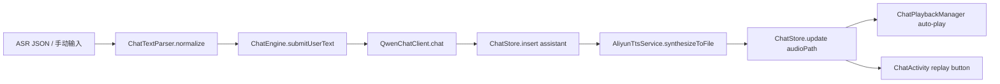

# 语音对话开发手册（ASR + 大模型 + TTS）

本文档记录当前语音相关功能的实现方式、调用链路、关键文件、调试命令与常见问题，便于后续维护。

## 1. 功能范围

- ASR 识别结果（JSON）解析为纯文本
- 大模型（Qwen-Flash）问答
- 阿里云 TTS（voice=zhiyue, format=wav, sample=16000）
- 自动播放（全局，不依赖聊天页面）
- 重播按钮（聊天页面）
- 对话历史存储（JSON 文件）

## 2. 核心模块与职责

| 模块 | 位置 | 作用 |
| --- | --- | --- |
| ChatEngine | `CyanBridge/app/src/main/java/com/fersaiyan/cyanbridge/chat/ChatEngine.kt` | 统一对话入口，负责：文本归一化 -> LLM -> TTS -> 更新消息 |
| ChatTextParser | `CyanBridge/app/src/main/java/com/fersaiyan/cyanbridge/chat/ChatTextParser.kt` | ASR JSON 解析：优先 `payload.result` -> `result` -> 原文 |
| QwenChatClient | `CyanBridge/app/src/main/java/com/fersaiyan/cyanbridge/ai/QwenChatClient.kt` | 调用 Qwen-Flash API |
| AliyunTtsService | `CyanBridge/app/src/main/java/com/fersaiyan/cyanbridge/voice/AliyunTtsService.kt` | TTS 合成并保存 wav |
| ChatStore | `CyanBridge/app/src/main/java/com/fersaiyan/cyanbridge/chat/ChatStore.kt` | JSON 文件存储对话历史 |
| ChatPlaybackManager | `CyanBridge/app/src/main/java/com/fersaiyan/cyanbridge/chat/ChatPlaybackManager.kt` | 全局自动播放最新 TTS |
| ChatActivity | `CyanBridge/app/src/main/java/com/fersaiyan/cyanbridge/ui/chat/ChatActivity.kt` | UI 展示 + 手动重播 |
| MainActivity ASR | `CyanBridge/app/src/main/java/com/fersaiyan/cyanbridge/MainActivity.kt` | 接收 ASR JSON，交给 ChatEngine |
| Application | `CyanBridge/app/src/main/java/com/fersaiyan/cyanbridge/ui/MyApplication.kt` | 初始化 ChatEngine + 启动全局播放 |

## 2.1 关键配置（local.properties）

本功能依赖以下 Key，均已在 `local.properties` 配置：

```
DASHSCOPE_API_KEY=...
DASHSCOPE_BASE_URL=...
ALIYUN_ASR_APPKEY=...
ALIYUN_ASR_TOKEN=...
ALIYUN_TTS_APPKEY=...
ALIYUN_TTS_TOKEN=...
```

说明：
- TTS 未配置时会回退使用 ASR 的 key/token，但不保证可用。
- Qwen 走 DashScope OpenAI-compatible 接口。

## 3. 端到端调用链路



### 3.1 入口：ASR
- `AliyunAsrWakeSession.onResult(text)` -> `ChatEngine.submitUserText(text, ChatSource.ASR)`
- 注意：传入原始 JSON，解析由 `ChatTextParser.normalize()` 统一完成

### 3.2 入口：文本输入
- `ChatActivity` -> `ChatViewModel` -> `ChatEngine.submitUserText(text, ChatSource.TEXT)`

### 3.3 核心处理：ChatEngine
1) 归一化文本（支持 ASR JSON）
2) 写入用户消息
3) 调用 Qwen-Flash 获取回复
4) 写入 assistant 消息
5) 触发 TTS，得到 wav 文件
6) 更新 assistant 消息的 `audioPath`

### 3.4 实际运行流程（操作逻辑）
1) 语音触发或手动输入文本
2) 归一化 ASR JSON（只取 result）
3) 调用 Qwen-Flash（短回复）
4) TTS 合成 wav 文件
5) 更新对话消息（audioPath）
6) 自动播报（全局）+ 页面重播按钮可用

## 4. TTS 实现细节（AliyunTtsService）

### 4.1 关键参数
- voice: `zhiyue`
- format: `wav`
- sample_rate: `16000`
- tts_version: `0`（短文本）
- mode_type: `2`（云端）

### 4.2 必须注意的 SDK 规则
- `startTts` 参数顺序：`startTts(priority, taskId, text)`
- `taskId` 必须是 32 字符（UUID 去掉 `-`）
- `onTtsDataCallback(info, infoLen, data)` 中 **data 才是音频字节**，`info` 不是 taskId

### 4.3 TTS 文件位置
- `context.getExternalFilesDir("tts")/<messageId>.wav`
- 若 external 不可用，回退到 `cacheDir`

## 5. 全局自动播放

`ChatPlaybackManager` 在 `MyApplication.onCreate()` 启动：
- 监听 `ChatStore.observe()`
- 找到最新 assistant 且 `audioPath != null` 的消息
- 首次加载跳过历史
- 后续新消息自动播放

这样不管在哪个页面，都可以听到眼镜回复的语音。

## 6. 对话历史存储

- 文件：`/data/data/<pkg>/files/chat_history.json`
- 每条消息包含：id, role, content, status, source, audioPath, timestamps

## 7. 调试命令

### 7.1 日志（核心）
```
adb logcat -s ChatFlow ChatTts AliyunTts ChatAudio
```

### 7.2 常见问题定位
- **startTts ok 后无数据**：检查 `onTtsDataCallback` 参数使用是否正确
- **144002 (INVALID_MESSAGE)**：taskId 非 32 字符或 startTts 参数顺序错误
- **TTS saved 为空**：data 未写入（回调签名使用错误）
- **重播按钮不显示**：assistant 消息的 `audioPath` 未写入（查看 `ChatTts` 日志）

### 7.3 编译
```
JAVA_HOME=/opt/android-studio/jbr ./gradlew :app:assembleDebug
```

## 8. 常见错误码速查

- 144002: TTS_CLOUD_INVALID_MESSAGE（消息无效）
- 41020001: TaskFailed（通常为参数/权限问题）

## 9. 维护建议

- 任何 ASR 或 TTS 参数改动先在日志中确认：`NativeNui_JAVA param` 输出
- 依赖更新时需重新确认 `INativeTtsCallback` 方法签名
- 若要支持后台持续对话，需将播放或识别逻辑放到前台服务（避免进程被杀）

## 10. 关键代码片段（可移植）

以下片段为“最小可运行”核心逻辑，便于后续移植或二次开发。

### 10.1 ASR 结果入口（MainActivity）
```kotlin
// AliyunAsrWakeSession.onResult
onResult = { text ->
    Log.i("AliAsr", "result=$text")
    // 原始 JSON 交给 ChatEngine 统一解析
    ChatEngine.submitUserText(text, ChatSource.ASR)
    val normalized = ChatTextParser.normalize(text) ?: text
    runOnUiThread {
        Toast.makeText(this, "ASR: $normalized", Toast.LENGTH_LONG).show()
    }
}
```

### 10.2 ASR JSON 解析（ChatTextParser）
```kotlin
fun normalize(rawText: String): String? {
    val trimmed = rawText.trim()
    if (trimmed.isBlank()) return null
    if (trimmed.startsWith("{") && trimmed.endsWith("}")) {
        try {
            val obj = JSONObject(trimmed)
            val payload = obj.optJSONObject("payload")
            val payloadResult = payload?.optString("result")
            if (!payloadResult.isNullOrBlank()) return payloadResult.trim()
            val result = obj.optString("result")
            if (!result.isNullOrBlank()) return result.trim()
        } catch (_: Throwable) { }
    }
    return trimmed
}
```

### 10.3 对话引擎（ChatEngine）
```kotlin
fun submitUserText(rawText: String, source: String = ChatSource.TEXT) {
    val text = ChatTextParser.normalize(rawText) ?: return
    val now = System.currentTimeMillis()
    val userMessage = ChatMessageEntity(
        id = UUID.randomUUID().toString(),
        role = ChatRoles.USER,
        content = text,
        createdAt = now,
        status = ChatStatus.OK,
        source = source,
    )
    scope.launch {
        repository.insert(userMessage)
        generateAssistantReply(text)
    }
}

private suspend fun generateAssistantReply(userText: String) {
    val reply = qwen.chat(userText).trim()
    val assistantId = UUID.randomUUID().toString()
    val assistantMessage = ChatMessageEntity(
        id = assistantId,
        role = ChatRoles.ASSISTANT,
        content = reply,
        createdAt = System.currentTimeMillis(),
        status = ChatStatus.OK,
        source = ChatSource.SYSTEM,
    )
    repository.insert(assistantMessage)
    val audioPath = tts.synthesizeToFile(reply, assistantId)
    if (!audioPath.isNullOrBlank()) {
        repository.update(assistantMessage.copy(audioPath = audioPath))
    }
}
```

### 10.4 Qwen-Flash 调用（QwenChatClient）
```kotlin
val url = baseUrl.trimEnd('/') + "/compatible-mode/v1/chat/completions"
val messages = JSONArray()
    .put(JSONObject().put("role", "system").put("content", "请用简短、直接的方式回答。"))
    .put(JSONObject().put("role", "user").put("content", userText))
val payload = JSONObject()
    .put("model", "qwen-flash")
    .put("messages", messages)
    .put("max_tokens", 128)
    .put("temperature", 0.7)
```

### 10.5 阿里云 TTS 核心逻辑（AliyunTtsService）
```kotlin
// 32 字符 taskId，去掉 UUID 中的 '-'
val taskId = messageId.replace("-", "")
applyParams(ttsText)
val startRet = nui.startTts("1", taskId, ttsText)
if (startRet != Constants.NuiResultCode.SUCCESS) return null

// 回调收集数据
override fun onTtsDataCallback(info: String, infoLen: Int, data: ByteArray?) {
    if (data == null || data.isEmpty()) return
    buffer.write(data, 0, data.size)
}
```

### 10.6 全局自动播报（ChatPlaybackManager）
```kotlin
ChatStore.observe().collectLatest { list ->
    val latest = list.lastOrNull { it.role == ChatRoles.ASSISTANT && !it.audioPath.isNullOrBlank() }
    if (!initialized) { lastPlayed = latest?.audioPath; initialized = true; return@collectLatest }
    val path = latest?.audioPath ?: return@collectLatest
    if (path != lastPlayed) {
        audioPlayer.play(path)
        lastPlayed = path
    }
}
```

### 10.7 对话历史存储（ChatStore）
```kotlin
file = File(context.filesDir, "chat_history.json")
state.value = list
file.writeText(JSONArray().apply { list.forEach { put(it.toJson()) } }.toString())
```

### 10.8 重播按钮显示逻辑（ChatAdapter）
```kotlin
if (item.audioPath.isNullOrBlank()) {
    replayView.visibility = View.GONE
    replayView.setOnClickListener(null)
} else {
    replayView.visibility = View.VISIBLE
    replayView.setOnClickListener { onReplayClick(item) }
}
```
